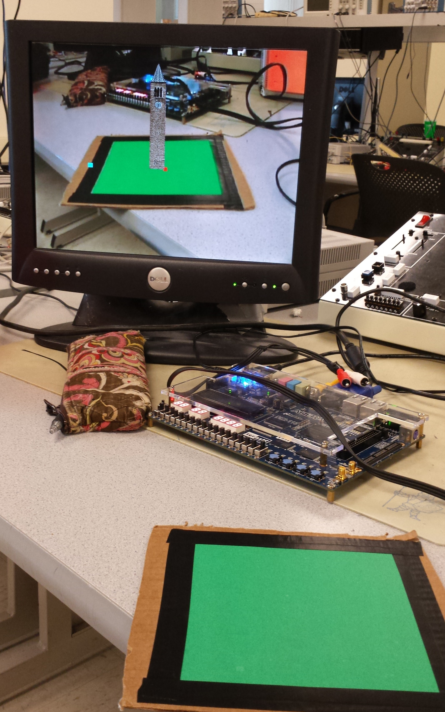
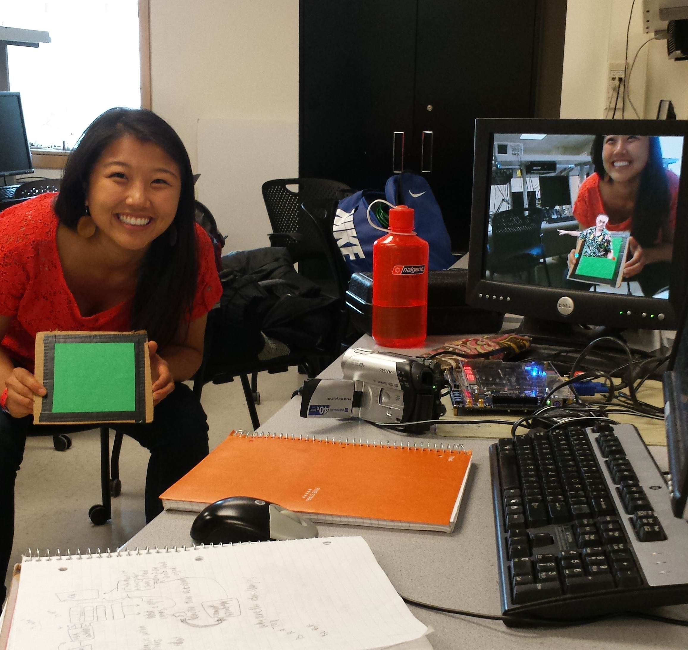

## Bruce in a Box
An augmented reality system that in real time detects the corners of a flat surface and draws an image over the original video feed.
Full project documentation: http://bit.ly/2pQUyCQ

## Platform
Built for an Altera FPGA DE2-115 Development Board. 
 
## Screenshots

